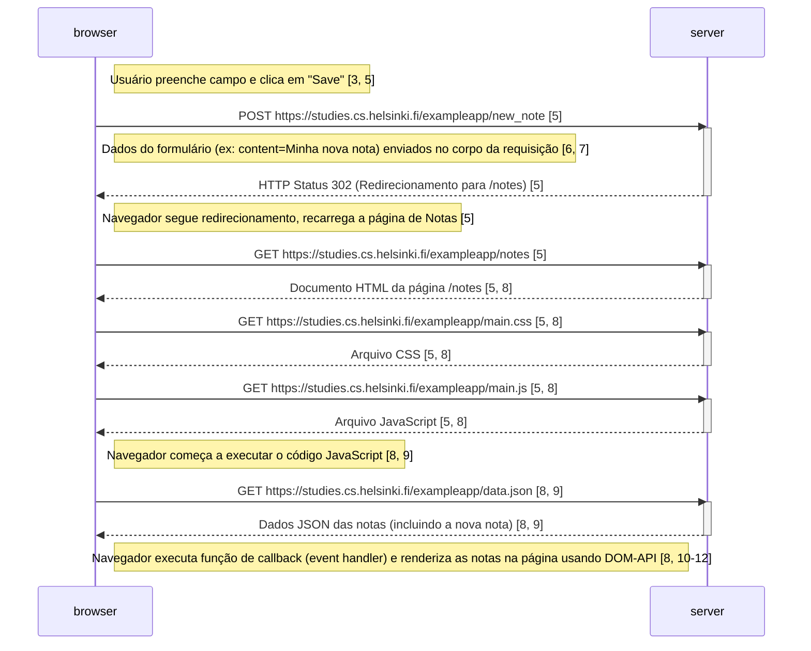

```mermaid
sequenceDiagram
    participant browser
    participant server

    Note right of browser: Usuário preenche campo e clica em "Save" [3, 5]
    browser->>server: POST https://studies.cs.helsinki.fi/exampleapp/new_note [5]
    activate server
    Note right of browser: Dados do formulário (ex: content=Minha nova nota) enviados no corpo da requisição [6, 7]
    server-->>browser: HTTP Status 302 (Redirecionamento para /notes) [5]
    deactivate server

    Note right of browser: Navegador segue redirecionamento, recarrega a página de Notas [5]
    browser->>server: GET https://studies.cs.helsinki.fi/exampleapp/notes [5]
    activate server
    server-->>browser: Documento HTML da página /notes [5, 8]
    deactivate server

    browser->>server: GET https://studies.cs.helsinki.fi/exampleapp/main.css [5, 8]
    activate server
    server-->>browser: Arquivo CSS [5, 8]
    deactivate server

    browser->>server: GET https://studies.cs.helsinki.fi/exampleapp/main.js [5, 8]
    activate server
    server-->>browser: Arquivo JavaScript [5, 8]
    deactivate server

    Note right of browser: Navegador começa a executar o código JavaScript [8, 9]
    browser->>server: GET https://studies.cs.helsinki.fi/exampleapp/data.json [8, 9]
    activate server
    server-->>browser: Dados JSON das notas (incluindo a nova nota) [8, 9]
    deactivate server

    Note right of browser: Navegador executa função de callback (event handler) e renderiza as notas na página usando DOM-API [8, 10-12]
```