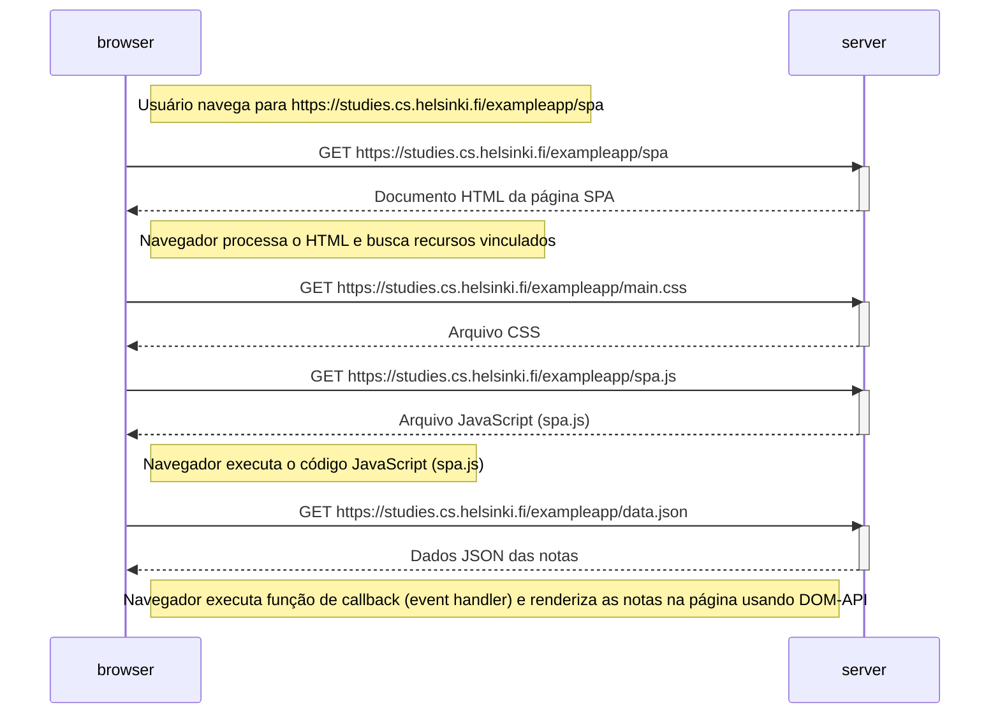

```mermaid
sequenceDiagram
    participant browser
    participant server

    Note right of browser: Usuário navega para https://studies.cs.helsinki.fi/exampleapp/spa
    browser->>server: GET https://studies.cs.helsinki.fi/exampleapp/spa
    activate server
    server-->>browser: Documento HTML da página SPA
    deactivate server

    Note right of browser: Navegador processa o HTML e busca recursos vinculados
    browser->>server: GET https://studies.cs.helsinki.fi/exampleapp/main.css
    activate server
    server-->>browser: Arquivo CSS
    deactivate server

    browser->>server: GET https://studies.cs.helsinki.fi/exampleapp/spa.js
    activate server
    server-->>browser: Arquivo JavaScript (spa.js)
    deactivate server

    Note right of browser: Navegador executa o código JavaScript (spa.js)
    browser->>server: GET https://studies.cs.helsinki.fi/exampleapp/data.json
    activate server
    server-->>browser: Dados JSON das notas
    deactivate server

    Note right of browser: Navegador executa função de callback (event handler) e renderiza as notas na página usando DOM-API
```